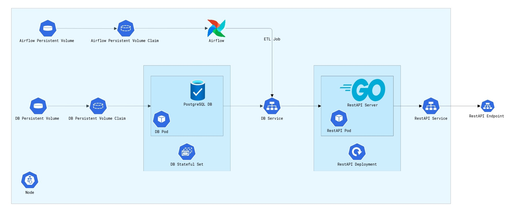

# Premier League Stats

This project consists of an ETL (Extract, Transform, Load) job with two phases, data analysis and storage, and a data access component. The overall goal is to process and analyze football data from FBRef.com for Premier League teams. The project utilizes various technologies, including PostgreSQL, Go web server, Airflow, and Kubernetes with Minikube and VirtualBox driver.

## Phase 1: Data Extraction, Transformation, and Loading

In the first phase of the ETL job, data is extracted from FBRef.com, followed by data wrangling and cleaning processes. The cleaned data is then loaded into a PostgreSQL database. This phase involves scraping relevant football data, applying data transformations and data cleaning techniques to ensure data quality, and storing the processed data into the PostgreSQL database.

## Phase 2: Relative Rankings Calculation

The second phase focuses on retrieving the data from the PostgreSQL database and performing calculations to determine relative rankings for midfield, attack, and defense for Premier League football teams. These rankings provide insights into the performance and effectiveness of different aspects of the teams' gameplay.

### Attack Rating

The attack rating is calculated as the mean of three metrics: goals scored, shots on target, and possession. Each metric is relatively ranked based on percentile between 35 and 100, indicating the team's performance compared to other teams. The higher the ranking, the better the performance in each metric. The mean of the three rankings represents the attack rating for the team.

Attack Rating = (Goals Scored + Shots on Target + Possession) / 3

### Midfield Rating

The midfield rating is calculated as the mean of five metrics: crosses, passes resulting in offside, passes blocked, assists, and key passes. Crosses, assists, and key passes are relatively ranked based on percentile between 35 and 100, indicating the team's performance in these metrics. Passes resulting in offside or being blocked are relatively ranked based on inverse percentile between 35 and 100, indicating the team's efficiency in these metrics. The mean of the five rankings represents the midfield rating for the team.

Midfield Rating = (Crosses + Passes Offside + Passes Blocked + Assists + Key Passes) / 5

### Defence Rating

The defense rating is calculated as the mean of four metrics: interceptions, percentage of tackles won, goals against, and shots on target against. First, the percentage of tackles won is calculated by comparing the total number of tackles made to the total number of tackles won. Interceptions and the percentage of tackles won are relatively ranked based on percentile between 35 and 100, representing the team's performance in these metrics. Goals against and shots on target against are relatively ranked based on inverse percentile between 35 and 100, representing the team's defensive capabilities. The mean of the four rankings represents the defense rating for the team.

Defense Rating = (Interceptions + Percentage of Tackles Won + Goals Against + Shots on Target Against) / 4

## Go Rest API

For data access, a Rest API is created using Go and the Gin web framework. The API connects to the PostgreSQL database and provides an interface to retrieve the stored data. This allows users to access the processed data and perform queries or retrieve specific information for further analysis or presentation.

## Orchestration and Infrastructure

The entire project is orchestrated using Apache Airflow, which manages the ETL workflow and schedule. Airflow enables automated execution and monitoring of the ETL tasks, ensuring timely and efficient data processing. The infrastructure is hosted on Kubernetes, specifically utilizing Minikube and the VirtualBox driver for local development. The Airflow instance is created using Helm charts, and a persistent volume and persistent volume claim are provisioned for Airflow DAG storage. The DAG is pre-populated in the persistent volume to ensure availability upon Airflow deployment.

## Architecture Diagram



## Usage

Building the images for the ETL job and RestAPI. We will be pushing it directly to the in-cluster docker daemon on minikube, this helps us build docker images inside the same docker daemon that the minikube uses which means you don’t have to build on your host machine and push the image into a docker registry thus speeds up local experiments.

```bash

    #To point your terminal to use the docker daemon inside minikube run this for powershell
    & minikube -p minikube docker-env --shell powershell | Invoke-Expression

    cd ETL

    #Building ETL Docker image
    docker build -t football_viz .

    cd ../RestApi

    #Building Go RestAPI Docker image
    docker build -t football_viz_api .

```

Create all kubernetes resources.

```bash

    cd kubernetes
    kubectl apply --recursive -f .

```

Below are the commands to populate the persistent volume with the DAG.

```bash

    minikube cp ./ETL/premier_league_dag.py  /home/k8/airflow-data/dags/premier_league_dag.py     

```

Below are the commands to deploy airflow using helm charts.

```bash

    helm upgrade --install airflow apache-airflow/airflow \
    --set executor=KubernetesExecutor \
    --set dags.persistence.enabled=true \
    --set dags.persistence.existingClaim=airflow-dags-persisent-volume-claim \
    --set dags.persistence.storageClassName=local-storage

```

## Conclusion

By leveraging these technologies and infrastructure, the project enables efficient ETL processing, relative rankings calculation, and data access for premier league data analysis. The combination of PostgreSQL, Go web server, Airflow, and Kubernetes provides a scalable, flexible, and robust framework for managing the entire data pipeline and analysis workflow.
